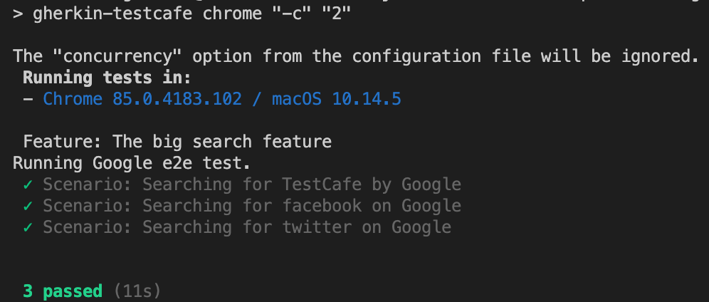

# Gherkin-Testcafe implementation

## Install and run test

```sh
$ cd testcafe-gherkin
$ npm install -d
$ npm run test
```

## Run test from runner file

```sh
$ npm run test:runner
```

## Concurrent test

```sh
$ npm run test -- -c 2
or
$ npm run test:parallel
```

Where 2 is the number of concurrent browsers




## Debug

```sh
$ npm run test:debug
```

License
----

> MIT


Rereferences
----

* [Gherkin-testcafe] - Run testcafe tests with gherkin syntax
* [Testcafe] - A node.js tool to automate end-to-end web testing


[Gherkin-testcafe]: <https://github.com/kiwigrid/gherkin-testcafe>
[Testcafe]: <https://devexpress.github.io/testcafe/>